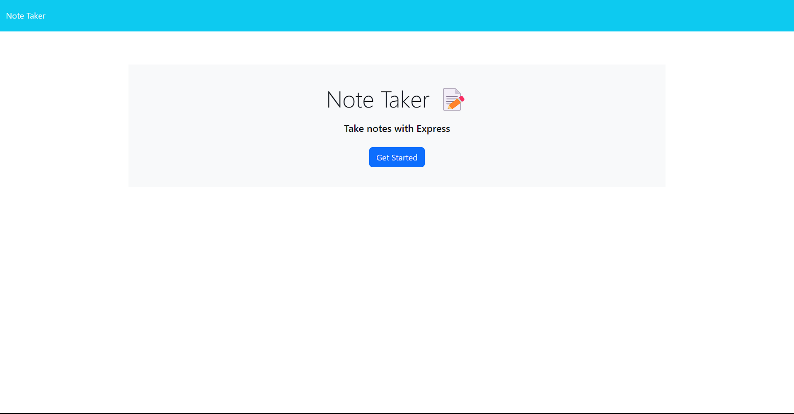
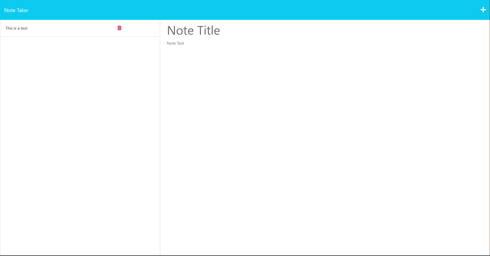

# Note Taking App

[](https://opensource.org/licenses/MIT)
[](https://www.npmjs.com/package/path)
[](https://www.npmjs.com/package/uuid)
[](https://www.npmjs.com/package/express)

## Description

The Note Taker app is designed for busy individuals, especially small business owners, seeking an efficient way to capture and organize thoughts and tasks. Upon launch, users are directed to an intuitive interface where existing notes are listed on the left and a space to create new notes on the right. As notes are penned, a "Save" icon ensures immediate storage. Selecting an existing note allows for easy review, and with the "Write" icon, users can swiftly transition back to crafting new entries. In short, Note Taker is a digital ally for optimal organization and task management.

## Table of Contents

- [Getting Started](#getting-started)
- [Usage](#usage)
- [Contributing](#contributing)
- [License](#license)
- [Credits](#credits)
- [Acknowledgements](#acknowledgements)
- [Questions](#questions)

## Getting Started

To get started, simply open the website in your browser.

```
https://note-taker-app-mc11-5489cd59dfe1.herokuapp.com/
```

## Usage

1. **Landing Page**: When you launch the Note Taker application, you'll be greeted with a landing page. Click on the "Get Started" button to proceed to the notes interface.

2. **Adding Notes**:

   - Once on the notes page, you'll find fields on the right-hand side for the note's title and text.
   - Fill out the title and text fields.
   - Upon entering the note details, a save icon will appear in the navigation at the top.
   - Click the save icon to store your note. Your newly created note will then appear in the list on the left-hand side.

3. **Viewing Existing Notes**:

   - To view a note, simply click on its title in the left-hand column.
   - The note's content will then be displayed on the right-hand side for easy viewing or editing.

4. **Starting a New Note**:

   - Click on the write icon (pencil icon) in the navigation at the top.
   - This will clear the right-hand fields, allowing you to enter a new note.

5. **Deleting Notes**:
   - Next to each note in the left-hand list, there's a delete/trash icon.
   - Click this icon to remove the respective note from your list.

Remember, the application automatically saves your notes locally, so they will remain available the next time you visit!




## Contributing

Please contact me for contributions

## License

This project is licensed under the MIT license.

```
Copyright <2023> <Brandon Zhang>

Permission is hereby granted, free of charge, to any person obtaining a copy of this software and associated documentation files (the “Software”), to deal in the Software without restriction, including without limitation the rights to use, copy, modify, merge, publish, distribute, sublicense, and/or sell copies of the Software, and to permit persons to whom the Software is furnished to do so, subject to the following conditions:

The above copyright notice and this permission notice shall be included in all copies or substantial portions of the Software.

THE SOFTWARE IS PROVIDED “AS IS”, WITHOUT WARRANTY OF ANY KIND, EXPRESS OR IMPLIED, INCLUDING BUT NOT LIMITED TO THE WARRANTIES OF MERCHANTABILITY, FITNESS FOR A PARTICULAR PURPOSE AND NONINFRINGEMENT. IN NO EVENT SHALL THE AUTHORS OR COPYRIGHT HOLDERS BE LIABLE FOR ANY CLAIM, DAMAGES OR OTHER LIABILITY, WHETHER IN AN ACTION OF CONTRACT, TORT OR OTHERWISE, ARISING FROM, OUT OF OR IN CONNECTION WITH THE SOFTWARE OR THE USE OR OTHER DEALINGS IN THE SOFTWARE.
```

## Credits

Brandon Zhang

## Acknowledgements

This project was made possible thanks to several tools and libraries:

- **Express**: A fast, unopinionated, minimalist web framework for Node.js that allowed for the efficient creation of our API endpoints. [View on npm](https://www.npmjs.com/package/express)
- **UUID**: A utility library that provides a simple way to create unique identifiers, which was essential for distinguishing individual notes in our application. [View on npm](https://www.npmjs.com/package/uuid)

- **Bootstrap**: A popular CSS framework that enabled quick and responsive design for our application. [View on npm](https://www.npmjs.com/package/bootstrap) or [Official website](https://getbootstrap.com/)

- **Node.js and npm**: The backbone of this project, providing the runtime and package management capabilities, respectively.

- **Heroku**: For deployment solutions, allowing this application to be accessible to users worldwide.

## Questions

If you have any questions, please feel free to contact me via email or on GitHub.

Email: branola1998628@gmail.com

GitHub: [verouge](https://github.com/verouge)
